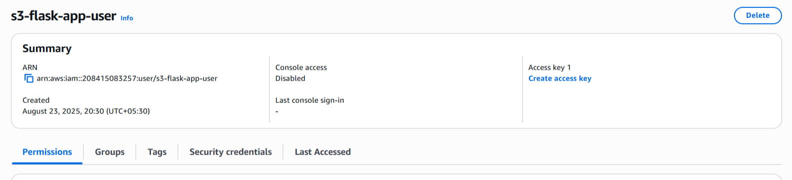

# AWS S3 Bucket Setup and Integration Guide

## Step 1: Create an AWS S3 Bucket

### Using AWS Console (Web Interface)
1. **Login to AWS Console**
   - Go to https://aws.amazon.com/console/
   - Login with your AWS credentials

2. **Navigate to S3**
   - Search for "S3" in the services search bar
   - Click on "S3" service

3. **Create Bucket**
   - Click "Create bucket"
   - **Bucket name**: Choose a globally unique name (e.g., `your-app-name-bucket-2024`)
   - **AWS Region**: Choose closest to your users (e.g., `us-east-1`)
   - **Block Public Access settings**: 
     - For image hosting, you might want to uncheck "Block all public access"
     - Be careful with public access - only allow what you need
   - **Bucket Versioning**: Enable if you want file version history
   - **Tags**: Add any relevant tags
   - Click "Create bucket"

4. **Configure Bucket Policy (if hosting images publicly)**
   - Select your bucket
   - Go to "Permissions" tab
   - Click "Bucket policy"
   - Add policy for public read access:

```json
{
    "Version": "2012-10-17",
    "Statement": [
        {
            "Sid": "PublicReadGetObject",
            "Effect": "Allow",
            "Principal": "*",
            "Action": "s3:GetObject",
            "Resource": "arn:aws:s3:::YOUR-BUCKET-NAME/*"
        }
    ]
}
```

## Step 2: Create IAM User for Programmatic Access

### Using AWS Console
1. **Navigate to IAM**
   - Search for "IAM" in the AWS console
   - Click on "IAM" service

2. **Create User**
   - Click "Users" → "Create user"
   - **User name**: `s3-flask-app-user`
   - **Access type**: Select "Programmatic access"
   - Click "Next: Permissions"

3. **Set Permissions**
   - Click "Attach existing policies directly"
   - Search for and select `AmazonS3FullAccess` (for full S3 access)

4. **Review and Create**
   - Review settings
   - Click "Create user"
   
   - go to "Create access key"
   - choose other
   - leave Description tag value empty
   - create user
   - Save the Access Key ID and Secret Access Key shown

## Step 3: Configure Your Flask Application

### 1. Create/Update .env File
Update `.env` file in your `flask-be` directory:

Update the following variables in your `.env` file:
```bash
# AWS S3 Configuration
AWS_ACCESS_KEY_ID=your-access-key-id-here
AWS_SECRET_ACCESS_KEY=your-secret-access-key-here
AWS_REGION=us-east-1
S3_BUCKET_NAME=your-bucket-name-here
```

### 2. Your Flask App Already Has S3 Integration!
Your `app.py` already includes:
- S3 client configuration
- File upload function (`upload_to_s3`)
- Integration with blog post creation

## Step 4: Test S3 Connection

### Method 1: Python Script Test
Create a test script to verify connection run:

```bash
python setup_s3.py
```
